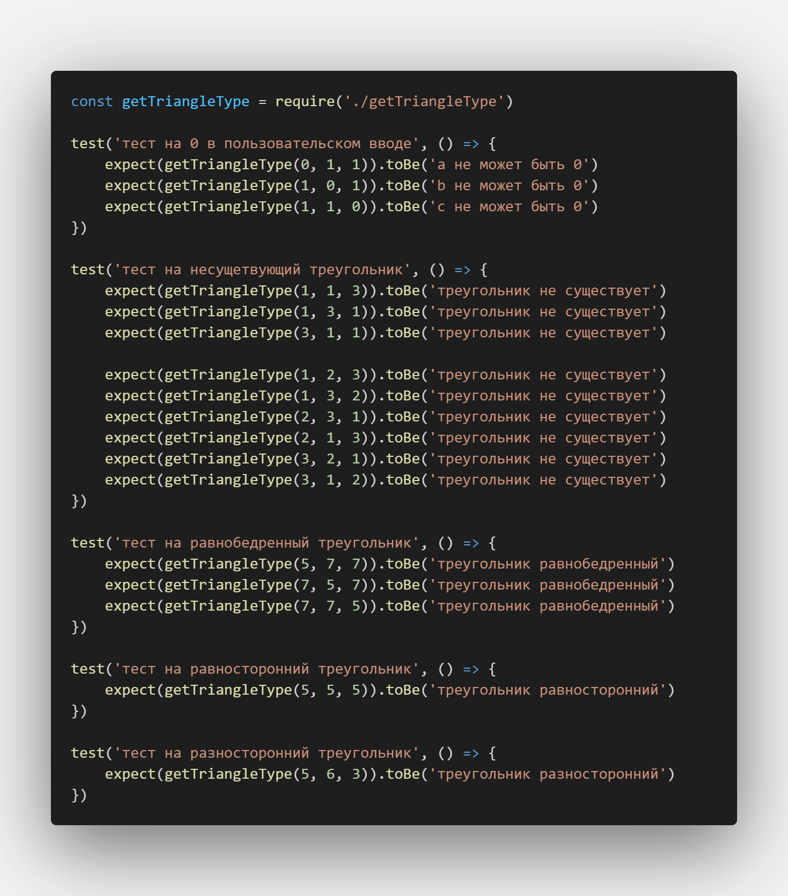

---
tags:
- тестирование
- лаба
---
<h5 align="center">Лабораторная работа № 1</h5>

<h5 align="center">Разработка и оценка эффективности набора тестов</h5>

**Цель работы:** 
получить навыки в составлении набора тестов и оценить их полноту.

<h5 align="center">Ход работы:</h5>

Задание 1: написать небольшую программу, которая представляет собой три поля, в которые вводятся целые числа – это длины сторон треугольника. После того, как нажата кнопка «Проверить», выводится сообщение о том, какой это треугольник: равнобедренный, равносторонний или разносторонний.

Задание 2: составить набор тестов, то есть набор входных данных, которые, по вашему мнению, правильно проверят эту программу.

