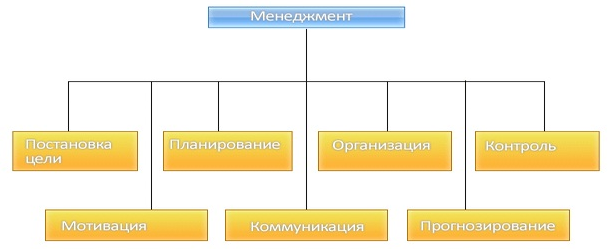

*2021-09-06*

# Роли руководителя
---
>Исследования показывают, что управленческая работа по сути своей очень сильно отличается от неуправленческой. И действительно, работа начальника цеха имеет гораздо больше общего с работой президента компании, чем с работой людей, которые находятся под его управлением.

>Руководитель не вправе ожидать **однородности** в своей работе. Характерным для него будет **кратковременность**, **разнообразие** и **фрагментарность** осуществляемой деятельности.

## Роли руководителя.

Минцберг находит общую черту управленческой работы - роли руководителя. Роль, по его определению, является

>“набором определённых поведенческих правил, соответствующих конкретному учреждению или конкретной должности”. 

Менеджеры занимают определённые должности в качестве руководителей определённых организационных подразделений, и это определяет их служебное поведение.

Минцберг выделяет 10 ролей, которые. По его мнению, принимают на себя руководители в различные периоды и в разное время.

Он классифицирует их в З крупные категории:
- межличностные роли (сюда входят роли: главного руководителя, лидера, связующего звена);
- информационные роли (приемник информации, распространитель информации, представитель);
- роли по принятию решений (предприниматель, устраняющий нарушения, распределитель ресурсов, ведущий переговоры).

Все 10 ролей, взятые вместе, определяют объём и содержание работы менеджера, независимо от характера конкретной организации.

>Управление - это процесс планирования, организации, мотивации и контроля, необходимой для того, чтобы сформулировать и достичь целей организации.

# Виды деятельности в менеджменте.
---

- во-первых, умение - чтобы добиться успеха, надо знать, как это сделать и уметь применять свои знания на практике;
- во-вторых, достигать - в менеджменте необходимо не просто стараться изо всех сил, а именно достигать, пока вы не добились желаемого результата, вы не можете считать, что научились управлять;
- в-третьих, поставленных целей - цели должны быть выбраны и поставлены верно, в противном случае теряет смысл и первое и второе. 
# Деятельность менеджера.
---
Есть 5 базовых операций в работе каждого менеджера, какой бы он областью не занимался.

1. Менеджер устанавливает цели, определяет, каковы они должны быть. Определяет конкретные задачи в каждой группе целей, он решает, что должно быть сделано, чтобы достичь этих целей. Он делает их эффективными, сообщая их другим людям, чья работа нужна, чтобы их достичь.
2. Менеджер организует: он выбирает людей для решения задач, которые надо выполнить.
3. Менеджер поддерживает мотивацию и коммуникацию. Он составляет команду из людей, ответственных за различные работы. Он делает это через кадровые решения об оплате, назначениях, повышениях и через множество разнообразных решений, определяющих так называемое “качество трудовой жизни”:

Оно не сводится ни к зарплате, ни к условиям труда в нашем обычном понимании. Он делает это, поддерживая постоянную коммуникацию со всеми подчинёнными, начальниками, коллегами.

>Мотивация - процесс стимулирования себя и других, на деятельность. Направленную на достижение индивидуальных и общих целей организации.

>Коммуникация - общение, обмен информацией и смыслом информации между двумя и более людьми.

4. Измерение. Он добивается, чтобы у каждого человека были показатели, сфокусированные на работе всей организации, и в то же время на работе данного индивида и помогали ему её делать. Он анализирует, оценивает и интерпретирует (истолковывает) результаты. Он сообщает о них своему руководителю, подчинённым и коллегам.
5. Он способствует росту людей, включая себя самого.

Основные черты менеджера:
- компетентность;
- достоинство и высшая ответственность;
- чувство нового и умение рисковать;
- чувствительность и подвижность;
- высокая работоспособность.

---

##    #homework 

- [x]  Сделано
	- [x] законспекрировать из файла

_Закреп:_
