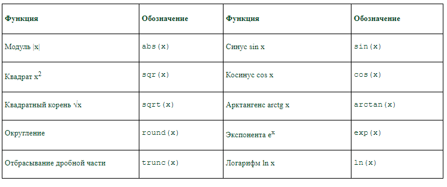

---
tags:
- разработка
- лаба
---
<h5 align="center">Лабораторная работа № 10-11</h5>

<h5 align="center">"Программная реализация линейного алгоритма"</h5>

**Цель работы:** 
Научиться решать задачи с помощью линейного алгоритма.

<h5 align="center">Теория</h5>

Любой алгоритм можно составить из нескольких базовых структур. Простейшей из них является линейная (следование).
Линейный алгоритм (следование) образуется командами, выполняемыми однократно в той последовательности, в которой они записаны.

Чтобы составить программу линейной структуры...
Определить, что является исходными данными, какие будут у них типы. Выбрать имена переменных.
Определить, что является искомыми результатами, какие будут у них типы. Выбрать имена переменных.
Определить, какие формулы связывают исходные данные с результатами.
Если нужны промежуточные данные, определить их типы и выбрать имена вспомогательных переменных.
Описать все используемые переменные.
Записать алгоритм, который должен включать:
- ввод всех исходных данных;
- вычисления;
- вывод результатов.
Будьте внимательны: вспомогательная переменная должна получить значение до того, как она будет использована в вычислениях.
Подобрать данные для тестирования программы (проверки правильности ее работы).
Запись любой функции (независимо от того, как она записывается в математике) состоит из имени функции и её параметра (аргумента), указанного в скобках после имени.

Традиционно при изучении нового языка программирования первой программой, которую пишет программист, является программа «Hello, world!». 
1. Запустите программу MSVisualStudio 2010.
2. Создайте новый проект (меню Файл/Создать/Проект). В списке языков выберите Visual C# win32, Консольное приложение, ниже введите имя проекта и выберите папку для его расположения (рекомендуется создать на диске D папку и назвать ее своими именем и фамилией, не рекомендуется работать с флешки, так как это сильно замедляет процессы компиляции и сборки!). Должно получиться примерно следующее:

3. Выберите в обозревателе решений (слева) файл с тем именем, которое вы дали проекту. В этом файле необходимо написать следующий код:

```C#
using System;
namespace HelloWorld
{
 class Hello 
 {
 static void Main() 
 {
 Console.WriteLine("Hello World!");
 // Keep the console window open in debug mode.
 Console.WriteLine("Press any key to exit.");
Console.ReadKey();}}}.
```

<h5 align="center">Ход работы:</h5>

4. Даны три действительных числа. Найти среднее арифметическое и среднее геометрическое их модулей.

```C#
Console.WriteLine("Введите первое число:");
int a = Convert.ToInt32(Console.ReadLine());
Console.WriteLine("\nВведите второе число:");
int b = Convert.ToInt32(Console.ReadLine());
Console.WriteLine("\nВведите третье число:");
int c = Convert.ToInt32(Console.ReadLine());
Console.WriteLine("\nСреднее арифметическое:");
Console.WriteLine(Convert.ToDouble((a + b + c) / 3)); 
Console.WriteLine("\nСреднее геометрическое:"); 
Console.WriteLine(Convert.ToDouble(Math.Pow((a * b * c), 1 / 3)));
Console.ReadLine();
```

<h5 align="center">Контрольные вопросы:</h5>

1. Что такое линейный алгоритм?
	- Линейный алгоритм (следование) образуется командами, выполняемыми однократно в той последовательности, в которой они записаны.
2. Перечислите математические операции и их обозначения.
	
3. Перечислите математические функции и их обозначения.
	
