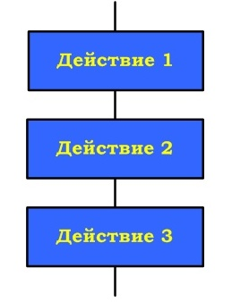

---
tags:
- разработка
- лаба
---

<h5 align="center">Лаботаторная работа № 2-3</h5>

<h5 align="center">«Оценка сложности и оформление алгоритмов линейной структуры»</h5>

**Цель работы:** ознакомиться оператором ветвления и научиться составлять программы с его использованием.

Алгоритм линейной структуры - последовательность действий и не содержит каких-либо условий.
линейные алгоритмы выполняются в естественном порядке его написания и не содержит разветвлений и повторений.

***Рисунок 1 – Последовательность действий***

На практике линейные алгоритмы в чистом виде встречаются редко
Даны катеты прямоугольного треугольника. Найти его периметр.
Листинг:

```c++
static void Main(string[] args)
{
 int a,b; double c,p;
 Console.WriteLine("Даны катеты прямоугольного треугольника. Найти его периметр.");
 Console.Write("Введите длину катета А=");
 a = Convert.ToInt32(Console.ReadLine());
 Console.Write("Введите длину катета B=");
 b = Convert.ToInt32(Console.ReadLine());
 c = Math.Sqrt(Math.Pow(a, 2) + Math.Pow(b, 2));
 Console.Write("Длина гипотенузы равна "+"{0:0.00}",c);
 Console.WriteLine();
 p = a + b + c;
 Console.Write("Периметр треугольника равен " + "{0:0.00}", p);
}

```


<h5 align="center">Ход работы:</h5>

4. Даны три действительных числа. Найти среднее арифметическое и среднее геометрическое их модулей.

код:
```js
const inquirer = require('inquirer');
inquirer
    .prompt([
        { type: 'number', message: 'Введите первое число:', name: 'a' },
        { type: 'number', message: 'Введите второе число:', name: 'b' },
        { type: 'number', message: 'Введите третье число:', name: 'c' },
        { type: 'number', message: 'округлить до:', name: 'round' }
    ])
    .then((answers) => {
        console.log(`среднее арифметическое: ${arithmeticMean(answers.a, answers.b, answers.c, answers.round)}`)
        console.log(`среднее геометрическое: ${geometricMean(answers.a, answers.b, answers.c, answers.round)}`)
    })
    .catch((error) => {
        console.log(error);
    });

function arithmeticMean(a, b, c, round) {
    a = Math.abs(a)
    b = Math.abs(b)
    c = Math.abs(c)
    return ((a + b + c) / 3).toFixed(round)
}

function geometricMean(a, b, c, round) {
    a = Math.abs(a)
    b = Math.abs(b)
    c = Math.abs(c)
    return Math.cbrt((a * b * c)).toFixed(round)
}
```
выполнение:


<h5 align="center">Контрольные вопросы:</h5>

1. Что такое линейный алгоритм?
	- **Линейный** **алгоритм** – это **алгоритм**, в котором блоки выполняются последовательно сверху вниз от начала до конца.
2. Как выполняются этапы решения в линейном алгоритме?
	- **Линейная** алгоритмическая конструкция. **Линейным** называется **алгоритм**, в котором все **этапы** **решения** задачи. **выполняются** ровно один раз и строго последовательно. Т. е. **линейный**. (последовательный) **алгоритм** **выполняется** в естественном порядке его.
3. Какова общая структура программы, написанной на языке C#?
	- Общая структура приложения может быть описана следующим образом:
	1. Программа состоит из описаний пользовательских типов (в основном классов)
	2. Описания классов состоят из описания полей (переменных) и методов
	3. Описание переменных состоит из указания типа и имени переменной
	4. Описание методов состоит из описания локальных переменных и набора операторов
	5. Оператор состоит из набора ключевых слов и выражений
	6. Выражения состоят из переменных и констант, связанных знаками операций
4. В каких задачах используется линейный алгоритм?
	- **Линейные** программы обычно предназначены для решения простейших **задач**, в которых не предусмотрен выбор из нескольких возможных направлений хода программы или циклическое повторение операций.