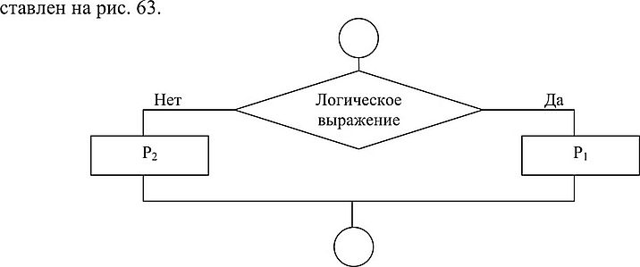

---
tags:
- разработка
- лаба
---

<h5 align="center">Лаботаторная работа № 4-5</h5>

<h5 align="center">«Оценка сложности и оформление алгоритмов разветвляющейся структуры (ветвление)»</h5>

**Цель работы:** ознакомиться с оператором ветвления и научиться составлять программы с его использованием.

<h5 align="center">Теория</h5>

Алгоритм называется разветвляющимся, если последовательность выполнения шагов алгоритма изменяется в зависимости от выполнения некоторых условий. Условие — это логическое выражение, которое может принимать одно из двух значений: «ДА» — если условие верно (истинно), «НЕТ» — если условие неверно (ложно).
	Простой условный оператор
	Общий вид в алгоритме конструкции простого условного оператора представлен на рисунке 2.



Синтаксис простого условного оператора следующий:
```js
if (Логическое выражение)
	р, ;
else
	р2;
```	
где if (если), else (иначе) — зарезервированные слова, а Р1 Р2 — операторы. Простой условный оператор работает по следующему алгоритму.
Сначала вычисляется логическое выражение. Если результат есть true (истина), то выполняется оператор Р1 а оператор Р2 пропускается. Если результат есть false (ложь), то выполняется оператор Р2, а оператор Р1 пропускается.
Например, в листинге в зависимости от результата сравнения двух переменных выводится тот или иной ответ.
Листинг

```c#
{
    private void Forml_Load(object sender, EventArgs e)
	int a=l; int b=5; if (a<b)< p=""></b)<>
	MessageBox.Show("Тест 1 ветви ", "Заголовок окна", MessageBoxButtons.OK, 		MessageBoxIcon.Information);
	else
	MessageBox.Show("Тест 2 ветви ", "Заголовок окна", MessageBoxButtons.OK, 		MessageBoxIcon.Information);
    Application.Exit();
}
```


<h5 align="center">Ход работы:</h5>

4. Даны действительные числа х и у, не равные друг другу. Меньшее из этих двух чисел заменить половиной их суммы, а большее — их удвоенным произведением.

```js
const inquirer = require('inquirer');

class ValidationError extends Error {
    constructor(message) {
        super(message); // (1)
        this.name = "ValidationError"; // (2)
    }
}

inquirer
    .prompt([
        { type: 'number', message: 'Введите первое число:', name: 'x' },
        { type: 'number', message: 'Введите второе число:', name: 'y' },
    ])
    .then((answers) => {
        if (answers.x == answers.y) throw new ValidationError("X не может быть равен Y!")
        let res = clac(answers.x, answers.y)
        console.log(answers.x = res.x)
        console.log(answers.y = res.y)
    })
    .catch((error) => {
        console.log(error);
    });

function clac(x, y) {
    if (x > y) {(y + x)/2
        return {x: (y * x)*2, y: (y + x)/2}
    } else {
        return {x: (y + x)/2, y: (y * x)*2}
    }
    
}
```
выполнение:

<h5 align="center">Контрольные вопросы:</h5>

1. Назначение, формы записи и порядок выполнения оператора ветвления?
- для ветвления алгоритма
- ```js
    if (*условие*) {*то*}
    else {*то*} 
- Сначала вычисляется логическое выражение. Если результат есть true (истина), то выполняется оператор Рь а оператор Р2 пропускается. Если результат есть false (ложь), то выполняется оператор Р2, а оператор Р! пропускается.
2. Как выглядит блок-схема программы с ветвлением?

