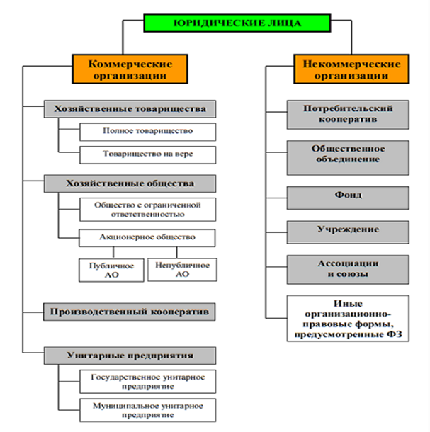

*2021-11-08*
Тэги: #право #конспект 
# Понятие юридического лица, его признаки
---

**Юридическое лицо** – правоспособная организация, т.е. организация, созданная в установленном законом порядке и осуществляющая хозяйственную деятельность в целях удовлетворения общественных потребностей.

**Признаками юридического лица являются:**

организационное единство (внутренняя структура организации должна отвечать ее целям и задачам);

индивидуальность (собственное наименование);

самостоятельное участие в гражданском обороте (осуществление прав и исполнение обязанностей);

имущественная обособленность (имущество должно принадлежать самой организации);

самостоятельная имущественная ответственность (ответственность по своим долгам всем своим имуществом).

Все юридические лица подразделяются на две группы: коммерческие и некоммерческие организации. Организационно-правовая форма — способ закрепления и использования имущества хозяйствующим субъектом и вытекающие из этого его правовое положение и цели предпринимательской деятельности.

Выделяют следующие организационно-правовые формы юридических лиц. Коммерческими организациями являются юридические лица, основная цель деятельности которых – получение прибыли. К ним относятся:

**Полное товарищество** – организация, участники которой на основе учредительного договора занимаются предпринимательской деятельностью от имени товарищества и несут ответственность по обязательствам товарищества не только объединенным капиталом, но и личным имуществом.

**Товарищество на вере (коммандитное товарищество)** – товарищество, в котором помимо полных товарищей участвуют вкладчики, которые рискуют лишь вкладом в уставный капитал. По окончании финансового года вкладчик может выйти из товарищества, получив свой вклад. При выбытии всех вкладчиков товарищество ликвидируется или преобразуется в полное товарищество.

**Общество с ограниченной ответственностью (ООО)** – хозяйственное общество с уставным капиталом, разделенным на доли, размер которых определен учредительными документами, участники которого не отвечают по его обязательствам и рискуют лишь внесенными ими вкладами.

**Акционерное общество (АО)** – общество, уставный капитал которого разделен на определенное число акций, а его участники не отвечают по его обязательствам, а несут риск убытков в пределах стоимости принадлежащих им акций. Различают публичное и непубличное АО. Публичное АО проводит публичную подписку на свои акции, число акционеров не ограничивается, акционеры которого пользуются правом отчуждать свои акции. Непубличное АО – общество, акции которого распределяются только среди его учредителей или заранее определенного круга лиц, число которых ограничиваются 50- тью членами. При превышении числа членов должно преобразоваться в течение года в ПАО.

**Производственный кооператив** – добровольное объединение граждан (не менее 5) на основе членства для совместной хозяйственной деятельности с целью получения прибыли и последующего ее распределения между членами кооператива (деятельность основана на личном трудовом участии).

**Унитарное предприятие** – государственное или муниципальное предприятие, не наделенное правом собственности на закрепленное за ним имущество. При его создании имущество (уставный фонд) выделяется из бюджета РФ, субъектов РФ или местного бюджета.

**Некоммерческие организации** – это юридические лица, не преследующие цели извлечения прибыли либо не распределяющие полученную прибыль между участниками (ст.50 ГК РФ). К ним относятся:

**Потребительский кооператив** – добровольное объединение граждан и юридических лиц на основе членства с целью удовлетворения материальных и иных потребностей участников, осуществляемое путем объединения его членами имущественных паевых взносов.

**Общественное объединение** – добровольные объединения граждан, объединившихся на основе общности их интересов для реализации общих целей и удовлетворения духовных или иных нематериальных потребностей (общественная организация, политическая партия).

**Фонд** – организация, учрежденная гражданами или юридическими лицами на основе добровольных имущественных взносов, преследующая социальные, благотворительные, культурные, образовательные или иные общественно-полезные цели.

**Учреждения** – организация, созданная собственником для осуществления управленческих, социально-культурных и иных функций некоммерческого характера и финансируемая им полностью или частично (школы, библиотеки, музеи и т.д.) o

**Ассоциации и союзы** – добровольные объединения юридических лиц в целях координации их деятельности, а также представления и защиты общих имущественных интересов.

Организационно-правовой формой хозяйствующих субъектов без образования юридического лица является: Индивидуальный предприниматель (ИП) — физическое лицо, зарегистрированное в установленном законом порядке и осуществляющее предпринимательскую деятельность без образования юридического лица.

Юридическим лицом как самостоятельным субъектом права организация может стать лишь при условии ее государственной регистрации. Для этого необходимо явиться в уполномоченные государственные органы, которыми в настоящее время являются органы Министерства РФ по налогам и сборам (ФЗ от 8 августа 2001г. «О государственной регистрации юридических лиц»). Создать юридическое лицо может одно или несколько лиц, которые именуются учредителями. В качестве них могут выступать любые субъекты гражданского права, обладающие необходимым объемом право- и дееспособности: физические и юридические лица, РФ, субъекты РФ, муниципальные образования.

Учредители должны составить и утвердить учредительные документы, которыми являются:

**Учредительный договор** – договор, заключаемый учредителями, в котором они обязуются создать юридическое лицо и определяют объем его правоспособности, условия передачи ему своего имущества и участие в его деятельности (вступает в силу с момента его заключения) – для хозяйственных товариществ;

**Устав** – локальный акт самой организации, утверждаемый учредителями, который также определяет правовой статус организации (вступает в силу с момента регистрации) – для АО, кооперативов, унитарных предприятий, некоммерческих организаций. Оба этих документа необходимы для образования ООО.

В учредительных документах юридического лица должны определяться:

наименование юридического лица;

 место его нахождения;

порядок управления деятельностью юридического лица;

иные сведения, предусмотренные законом для конкретных видов юридических лиц.

Для регистрации юридического лица учредители должны предоставить в регистрирующий орган следующие документы:

1) заявление о государственной регистрации юридического лица, подписанное учредителями;

2) решение о создании юридического лица в виде протокола, договора или иного документа в соответствии с законодательством;

3) учредительные документы юридического лица;

4) документ об уплате государственной пошлины;

5) если одним из учредителей юридического лица является иностранное юридическое лицо – документ, подтверждающий его юридический статус.

**Государственная регистрация** осуществляется в срок не более 5 рабочих дней с момента предоставления документов. Моментом Государственной регистрации является внесение записи в Государственный реестр юридических лиц. Именно в этот момент юридическое лицо считается созданным и у него возникают гражданские право- и дееспособность. Отказ в регистрации при предоставлении документов не допускается. После этого для осуществления определенных видов деятельности требуется получить лицензию.

**Реорганизация** – это различные формы изменения правового статуса юридического лица. Существует пять форм реорганизации:

 1) слияние – вместо нескольких организаций образуется одна новая организация, к которой переходят все права и обязанности прекращенных юридических лиц;

2) присоединение – к одному юридическому лицу присоединяются другие, которые прекращают свое существование, передавая ему свои права и обязанности;

3) разделение – одно юридическое лицо разделяется на несколько новых юридических лиц, к которым переходят права и обязанности прекратившего свое существование юридического лица;

4) выделение – из состава юридического лица выделяется структурная единица, которая становится самостоятельным юридическим лицом, получая часть прав и обязанностей выделившей ее организации;

5) преобразование – это изменение юридическим лицом своей организационно-правовой формы.

Вследствие реорганизации юридических лиц происходит правопреемство, т.е. переход прав и обязанностей от одних юридических лиц к другим. Правопреемство оформляется передаточным актом (при слиянии, присоединении, преобразовании) или разделительным балансом (при разделении и выделении). Реорганизация может быть произведена в добровольном или принудительном порядке. Реорганизация производится путем регистрации вновь создаваемых юридических лиц и исключением из реестра юридические лица, прекратившие свое существование вследствие реорганизации.

---

##    #homework 

- [ ]  Сделано
	- [ ] 

_Закреп:_
