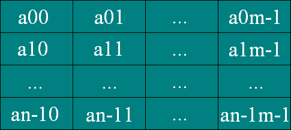

---
tags:
- разработка
- лаба
---
<h5 align="center">Лабораторная работа № 24-25</h5>

<h5 align="center">«Программная реализация одномерных и двумерных массивов»</h5>

**Цель работы:** 

<h5 align="center">Теория</h5>

**Массив** – это набор однотипных данных, которые располагаются в памяти последовательно друг за другом. Доступ к элементам массива осуществляется по индексу (номеру) элемента. Массив может содержать элементы любого типа данных, можно даже создавать массив массивов (ступенчатый массив). Количество элементов в массиве называется размером массива. Массивы относятся к ссылочным типам данных.

Массивы в C# могут быть одномерными и многомерными. Одномерный массив по-другому еще называется вектором, и для доступа к его элементам используется только один индекс. Выглядит вектор примерно так:

В C# объявление массива имеет такую структуру:
```C#
тип[] имя_массива = new тип[размер массива]; 
```
**Пример:**

```C#
int[] array = new int[5]; // создаем массив целых чисел 
string[] seasons = new string[4] {"зима","весна","лето","осень"}; 
//объявление массива строк и его инициализация значениями
```

Если происходит инициализация, оператор new можно упускать: 

```C#
string[] seasons = {"зима","весна","лето","осень"}; //корректно
```

Доступ к элементам осуществляется по индексу. Следует помнить, что индексация начинается с нуля – первый элемент массива имеет индекс 0, а последний n-1, где n – размер массива.

```C#
static void Main(string[] args) 
{
	int[] numbers = new int[5]; 
	numbers[0] = 5; 
	numbers[1] = 2; 
	numbers[4] = 3; 
	numbers[5] = 2; // ошибка, индекс вне рамок массива 
}
```

В качестве массива можно представить, например, список студентов в группе (имена), показатели температуры воздуха за последние несколько дней и так далее.

**Многомерные массивы**

Одним из случаев многомерного массива служит двумерный массив (матрица). В матрице для доступа к элементам необходимо использовать два индекса. 

Количеством индексов, используемых для доступа к элементам массива называется размерность массива.

```C#
int[,] numbers1 = new int[2, 2];// объявление двумерного массива 
int[,,] numbers2 = new int[2, 2 ,3]; // объявление трехмерного массива 
int[,] numbers3 = new int[3, 2] { {6, 0}, {5, 7}, {8, 9} }; // инициализация двумерного массива
```

Элементу массива numbers1 с координатами 1,1 присвоим значение 8: numbers1[1, 1] = 8; Многомерные массивы используются гораздо реже одномерных.

Приведём немного бредовый пример данных, которые можно было бы представить в качестве двумерного массива: Есть матрица 7*4. Строки, которых семь, будут соответствовать дням недели, а 4 столбца - времени дня (00:00, 06:00, 12:00, 18:00). В качестве данных будет температура воздуха. Значение температуры с координатами 2,3 будет соответствовать температуре в среду в 18:00. На практике, конечно, такие данные представлялись бы в другом виде, но для примера подойдет.

<h5 align="center">Ход работы:</h5>

```C#
static void Main(string[] args)
{
    Random rnd = new Random();

    Console.Write("Введите кол-во эллементов массива ");

    int[] array = new int[Convert.ToInt32(Console.ReadLine())];

    for (int i = 0; i < array.Length; i++)
    {
        array[i] = rnd.Next(-10, 10);
        Console.Write(array[i] + " ");
    }


    for (int i = 0; i < array.Length; i++)
    {
        if (i != 0 & i != array.Length & array[i] % 2 == 0)
        {
            array[i] += array[0];
        }
    }

    Console.WriteLine();

    for (int i = 0; i < array.Length; i++)
    {
        Console.Write(array[i] + " ");
    }

    Console.ReadKey();

}
```


<h5 align="center">Контрольные вопросы:</h5>

1. Каким образом определяются переменные типа массив (одномерный и двумерный)?
**одномерный:** 
```C#
int[] arr = new int[5]
```
**двумерный:** 
```C#
int[,] arr = new int[5, 5]
```
2. Как осуществляется доступ к отдельному элементу одномерного и двумерного массива?
**одномерный:** 
```C#
arr[2]
```
**двумерный:** 
```C#
arr[5, 5]
```
3. Приведите пример фрагмента программы, который выводит на экран массив.
```C#
for (int i = 0; i < array.Length; i++)
{
	Console.Write(array[i] + " ");
}
```